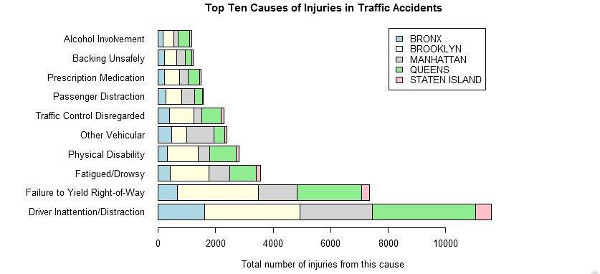
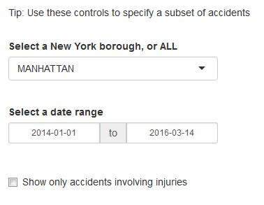
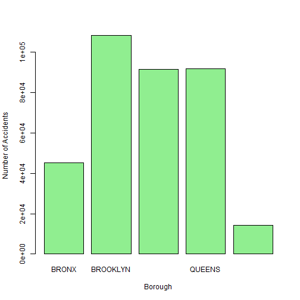
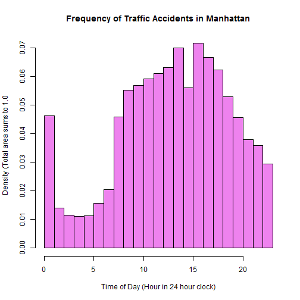
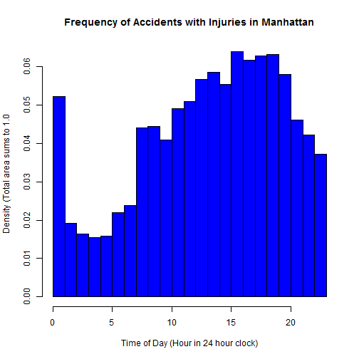

Analysis of Motor Vehicle Collisions in New York
========================================================
author: Tryfanak
date: June 5th, 2016

What This App Will Do For You
========================================================

This app is based on the [NYPD Motor Vehicle Collisions](https://data.cityofnewyork.us/Public-Safety/NYPD-Motor-Vehicle-Collisions/h9gi-nx95) dataset, published on the [NYC OpenData](https://data.cityofnewyork.us/) website. It allows you to explore certain aspects of this dataset interactively...

- Total number of vehicle collisions, and daily frequency
- Pattern of accidents over the 24-hour period
- Top 10 causes of vehicle collisions which injured people

The app has the capability to subset the data in different ways, to gain insight into the patterns and causes of vehicle collison

- Date range for collisons
- New York borough where the collision occurred
- Whether the collision caused any injuries

Introduction - How To Use The App
========================================================
<small>This is how you specify a subset of the dataset</small>

***
<small>This is the breakdown of data between boroughs</small>

App Insight - More Injuries at Night
========================================================

<small>Accidents peak in afternoon</small>
***

<small>Accidents peak in evening</small>

Find Out More About the App
========================================================
You can access the app at [shinyapps.io](https://tryfanak.shinyapps.io/NYPD_MVC/).

Source code (server.R and ui.R) for the app is in the [NYPD_MVC](Tryfanak/NYPD_MVC) repository on my github page. Look there to see the reactive elements and calculations I used in the app.

The [markdown file] for this presentation is also on github. Look there to see the R codes that is executed to create these slides.

Original data taken from [NYPD Motor Vehicle Collisions](https://data.cityofnewyork.us/Public-Safety/NYPD-Motor-Vehicle-Collisions/h9gi-nx95) dataset at NYC OpenData website.

